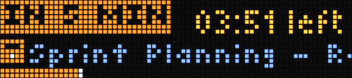

# GCal Glance: Google Calendar on Aero Horizon for BUSY Bar

A dedicated BUSY Bar application engineered as a high-density, near-field desktop flight deck for Google Calendar on a 72×16 RGB LED matrix. Designed to solve temporal blindness and deliver continuous situational awareness through dynamic radar horizons, procedural micro-glyphs, and multi-phase meeting lifecycle management.



---

## 🛫 Aero Horizon Design System

Aero Horizon divides the 72×16 canvas into 3 functional vertical tiers:

```
+------------------------------------------------------------------------+ y=0
| 10:48 AM   42m Focus Runway                      [NEXT 11:30A]         | Tier 1 (y=0..7): Telemetry Deck
+------------------------------------------------------------------------+ y=7/8
| [📹] 11:30 AM - Sprint Planning - Room 3B - Then: 1:00 PM 1-on-1       | Tier 2 (y=8..13): Marquee Stream (65px)
+------------------------------------------------------------------------+ y=13/14
| NOW ● ▓▓▓▓▓ (11:30-12:00) ░░░░░░░░░ ▓▓▓▓▓▓ (13:00-13:45)               | Tier 3 (y=14..15): Dual-Mode Horizon
+------------------------------------------------------------------------+ y=15
  x=0                                                               x=71
```

### 1. Tier 1: Near-Field Telemetry Deck (`y=0..7`)
- **Idle Mode**: 12h Wall Clock (`10:48 AM`), Dynamic Focus Runway (`42m Focus Runway`), and Compact Temporal Bookmark Pill:
  - Today's upcoming event: `[NEXT 11:30A]`
  - Tomorrow's first event: `[TMRW 5:51A]`
  - Multi-day future event: `[WED 8/19 10A]`
  - Clear schedule: `[FREE]`
- **Milestone Alerts**: High-contrast amber badge (`[⚡ IN 5 MIN]` / `[⚡ STARTING]`), scheduled start time, and live seconds countdown.
- **Active Mode**: Wall clock / start time, state badge (`[● LIVE CALL]`, `[● LIVE]`, `[⚡ WRAP UP]`, `[+04m OVER]`), and live remaining time.

### 2. Tier 2: Micro-Glyph & Wide Marquee Stream (`y=8..13`)
- **100% Procedural 5×5 Micro-Glyphs**: Zero binary assets. Composed dynamically using 3 rectangle primitives:
  - Video Call (`video`): 4x5 bezel + 1x3 optical lens + 2x3 cutout
  - Coffee / Break (`coffee`): 4x4 mug + 2x1 vapor plume + 1x2 handle
  - Studio Headphones (`focus`): 5x3 earcups + 3x2 headband arch + 1x4 inner gap
  - Cruiser Airplane (`travel`): 1x5 fuselage + 5x1 wingspan + 3x1 tail stabilizer
  - Activity Dumbbell (`fitness`): 5x3 bar + 3x5 weight plates + cutout
  - Celebration Star (`celebrate`): 1x5 vertical ray + 5x1 horizontal ray + 3x3 diamond burst
  - Overtime Hourglass (`overtime`): 5x5 hourglass vessel + waist pinch
  - Calendar Grid (`calendar`): 5x5 frame + top header cutout + day pin
- **Wide 65px Text Viewport**: Marquee scrolling for primary event title, location/platform, and configurable downstream schedule lookahead (default: 3 events).

### 3. Tier 3: Dual-Mode Dynamic Horizon (`y=14..15`)
- **Idle Proximity Radar**: 6-hour rolling window at $5\text{ min/px}$ (default, configurable via `--radar-window-minutes`). Visualizes current time anchor (`NOW ●` beacon at `x=0..1`) and proportional upcoming event blocks with accurate temporal spacing.
- **Precision Elapsed Horizon**: 72px active meeting gauge with 25%, 50%, and 75% tick marks (`#303030FF`) and a bright 1px white playhead needle (`#FFFFFFFF`).
- **Tight-Turn Pip (`▌`)**: Illuminates amber at `x=70` when the downstream meeting buffer is $<5\text{ minutes}$.

---

## 🔄 Multi-Phase Meeting Lifecycle

```mermaid
stateDiagram-v2
    [*] --> Idle: No Active Meeting
    Idle --> Alert: T-15m / T-5m / T-2m / T-0m Checkpoint
    Alert --> Idle: 15s Timeout Dismissal
    Idle --> Phase1: Event Starts (T-0s)
    Alert --> Phase1: Event Starts (T-0s)

    state "Active Meeting Lifecycle" as Active {
        Phase1: Phase 1 — Title Verification (0..15s)\n[● LIVE CALL] - Location - Room
        Phase2: Phase 2 — Focus Flight Deck\n[● LIVE] - 25/50/75% Ticks - Playhead
        Phase3: Phase 3 — Wrap-Up Cue (Last 3m)\n[⚡ WRAP UP] - Tight-Turn Pip
        Overtime: Phase 4 — Overtime Count-Up\n[+04m OVER] - Crimson Flash

        Phase1 --> Phase2: After 15s
        Phase2 --> Phase3: Rem <= 3m
        Phase3 --> Overtime: Rem < 0s
    }

    Active --> InterruptedAlert: Incoming Event Alert Overlay\n(Top Alert Banner + Preserved Horizon Bar)
    InterruptedAlert --> Active: 15s Alert Timeout

    Active --> Breather: Call Ends & Gap >= 10m\n[☕ 15m BREAK]
    Active --> Idle: Call Ends & Back to Runway
    Breather --> Idle: Next Call Approaches
```



---

## 🎮 Hardware Controls & Tactile Navigation

GCal Glance integrates directly with the BUSY Bar's physical rotary encoder dial and push buttons for responsive, tactile desktop interaction:

| Input Control | Hardware Action | Operational Behavior |
| :--- | :---: | :--- |
| **Rotary Dial (Encoder)** | **Rotate Left / Right** | **Interactive Agenda Peek**: Scrubs through upcoming calendar events one-by-one (`1/N`, `2/N`, `TMRW 3/N`, etc.) across the lookahead queue. Displays exact start time, duration, room/video link, and location in real-time. Automatically dismisses back to the live flight deck after 8 seconds of inactivity. |
| **`OK` Button** | **Press** | **Instant Manual Sync**: Triggers an immediate re-fetch and re-parse of your Google Calendar feed, bypassing the normal 120-second polling interval. A bright blue LED confirmation pulse acknowledges the sync request. |
| **`BACK` Button** | **Press** | **Exit & Dismiss**: Immediately exits Agenda Peek view back to the active flight deck, or dismisses an active approaching alert banner early. |
| **`START` Button** | **Press** | **Dismiss Alert**: Clears an active milestone alert banner early to return directly to the standard runway or active meeting view. |

---

## ⚙️ Configuration & Options

All configuration options can be set via command-line arguments or `.env` environment variables (prefixed with `GCAL_GLANCE_`, with `GCAL_` and `CALSYNC_` supported as fallbacks):

| Setting | CLI Flag | Env Variable | Default | Description |
| :--- | :--- | :--- | :---: | :--- |
| **Radar Window** | `--radar-window-minutes` | `GCAL_GLANCE_RADAR_WINDOW_MINUTES` | `360` | Duration of idle rolling radar window in minutes (60–1440). `360` = 6h window ($5\text{ min/px}$). |
| **Include All-Day** | `--include-all-day` | `GCAL_GLANCE_INCLUDE_ALL_DAY` | `false` | Include all-day calendar events (`VALUE=DATE`). |
| **Lookahead Count** | `--lookahead-count` | `GCAL_GLANCE_LOOKAHEAD_COUNT` | `8` | Number of upcoming events to cycle in the idle marquee stream & dial peek (2–20). |
| **iCal Feed URL** | `--ical-url` | `GCAL_GLANCE_ICAL_URL` | `None` | Google Calendar secret address in iCal format (`.ics`). |
| **Device Host** | `--host` | `GCAL_GLANCE_HOST` | `10.0.4.20` | BUSY Bar host IP or hostname (USB is always `10.0.4.20`). |
| **Demo Mode** | `--demo` | `GCAL_GLANCE_DEMO` | `false` | Run simulated multi-event schedule without a live calendar feed. |
| **Sound** | `--sound`<br>`--no-sound` | `GCAL_GLANCE_SOUND` | `true` | Enable audible alert chimes on approaching checkpoints and event start. |
| **Volume** | `--volume` | `GCAL_GLANCE_VOLUME` | `None` | Speaker volume level (0–100). Default `None` keeps device's current volume. |
| **Poll Interval** | — | `GCAL_GLANCE_CALENDAR_POLL_INTERVAL_SECONDS` | `120` | Frequency in seconds to re-fetch and parse the iCal feed. |
| **Alert Sequence** | — | `GCAL_GLANCE_UPCOMING_ALERT_SEQUENCE_MINUTES` | `15,5,2,0` | Alert checkpoint intervals before event start. |
| **Alert Duration** | — | `GCAL_GLANCE_ALERT_BANNER_DURATION_SECONDS` | `15` | Seconds the alert banner overlay stays on screen. |

---

## 🚀 Getting Started

### Prerequisites
- Python 3.10+
- [uv](https://github.com/astral-sh/uv) (recommended) or standard Python virtual environment

### 1. Normal Usage (Direct to Hardware)

The app is completely self-contained and drives the BUSY Bar directly over HTTP. Over USB, the physical bar is always reachable at `10.0.4.20`.

1. Open Google Calendar Settings $\rightarrow$ Select your calendar $\rightarrow$ Scroll to **Integrate calendar**.
2. Copy your **Secret address in iCal format** (`https://calendar.google.com/calendar/ical/.../basic.ics`).
3. Run the app:
```bash
uv run python app.py --ical-url "https://calendar.google.com/calendar/ical/.../basic.ics"
```
*(Tip: To run this continuously as a background service, check out the community [busybar-manager](https://github.com/maxswinkels/busybar-manager).)*

### 2. Local Development & Hot-Reloading

For quick design iteration without relying on live calendar events or physical hardware, you can use Demo Mode and the local emulator.

**Demo Mode:**
Run with a rich simulated multi-event schedule to preview all Aero Horizon phases and transitions:

**Hot-Reloading (Dev Loop):**
For instant feedback as you edit `app.py`, use `watchfiles` to automatically restart the script whenever you save a change. You can target either the physical device or the local emulator:

```bash
# Option A: Hot-reload directly to the physical BUSY Bar
uv run watchfiles "uv run python app.py --demo" app.py

# Option B: Hot-reload to the local busybar-emulator
uv run watchfiles "uv run python app.py --demo --host 127.0.0.1:8080" app.py
```

---

## 🏷️ Procedural 5×5 Micro-Glyphs & Emoji Engine

The Aero Horizon engine analyzes incoming calendar entries (emojis, keyword summaries, bracketed tags, and colors) and dynamically renders an illuminated 5×5 procedural micro-glyph (`x=0..4, y=8..12`) using 3 lightweight rectangle primitives with zero external assets.

### Micro-Glyph Visual Matrix Reference

| Micro-Glyph | 5×5 LED Pixel Matrix | Category & Keywords | Supported UTF-8 Emojis | Theme Color |
| :--- | :---: | :--- | :--- | :--- |
| **Video Call**<br>`video` | `█ █ █ █ ·`<br>`█ · · █ █`<br>`█ · · █ █`<br>`█ · · █ █`<br>`█ █ █ █ ·` | `meet`, `zoom`, `teams`, `sync`, `1:1`, `standup`, `call` | `📹`, `🎥`, `📞`, `📱`, `🎙️`, `💬`, `👥`, `👔` | Blue<br>`#4285F4` |
| **Coffee / Break**<br>`coffee` | `· █ █ · ·`<br>`█ █ █ █ █`<br>`█ █ █ █ █`<br>`█ █ █ █ ·`<br>`█ █ █ █ ·` | `coffee`, `break`, `lunch`, `tea`, `hydrate`, `decompress` | `☕`, `🍵`, `🧋`, `🍺`, `🍕`, `🍔`, `😎`, `🌴`, `🧘` | Green<br>`#34A853` |
| **Deep Focus**<br>`focus`<br>*(Headphones)* | `· █ █ █ ·`<br>`· █ · █ ·`<br>`█ █ · █ █`<br>`█ █ · █ █`<br>`█ █ · █ █` | `focus`, `deep work`, `coding`, `study`, `dnd`, `reading` | `🎯`, `🎧`, `🧠`, `💡`, `💻`, `⌨️`, `📝`, `📚`, `🔬` | Purple<br>`#A142F4` |
| **Transit / Travel**<br>`travel`<br>*(Airplane)* | `· · █ · ·`<br>`· · █ · ·`<br>`█ █ █ █ █`<br>`· · █ · ·`<br>`· █ █ █ ·` | `travel`, `flight`, `transit`, `train`, `bus`, `hotel`, `trip` | `✈️`, `🛫`, `🛬`, `🚌`, `🚍`, `🚗`, `🚆`, `🚇`, `🧳` | Amber<br>`#FBBC05` |
| **Fitness / Health**<br>`fitness`<br>*(Dumbbell)* | `· █ █ █ ·`<br>`█ █ █ █ █`<br>`█ · · · █`<br>`█ · · · █`<br>`· █ █ █ ·` | `run`, `gym`, `workout`, `fitness`, `walk`, `swim`, `cycle` | `🏃`, `🏋️`, `🚴`, `🏊`, `⚽`, `🏀`, `🥊`, `❤️`, `🩺` | Green<br>`#34A853` |
| **Celebration**<br>`celebrate`<br>*(Sparkle Star)* | `· · █ · ·`<br>`· █ █ █ ·`<br>`█ █ █ █ █`<br>`· █ █ █ ·`<br>`· · █ · ·` | `party`, `birthday`, `celebration`, `anniversary`, `happy hour` | `🎉`, `🎈`, `🎂`, `🥳`, `🎁`, `🍾`, `✨`, `⭐`, `🌟` | Crimson<br>`#EA4335` |
| **Overtime**<br>`overtime`<br>*(Hourglass)* | `█ █ █ █ █`<br>`█ · · · █`<br>`█ · █ · █`<br>`█ · · · █`<br>`█ █ █ █ █` | Meeting overrun ($>0\text{m}$) | `⏳`, `⌛` | Coral Red<br>`#EA4335` |
| **Calendar Grid**<br>`calendar` | `█ █ █ █ █`<br>`█ · · · █`<br>`█ █ █ █ █`<br>`█ █ █ █ █`<br>`█ █ █ █ █` | General scheduled task / default fallback | `📅`, `🗓️`, `📆`, `⏰`, `⏱️` | Blue<br>`#4285F4` |

---

## 🎨 Semantic Color Palette System

Aero Horizon employs a functional, aviation-inspired multi-tone semantic color palette designed for high contrast, zero color bleeding, and effortless peripheral recognition on the 72×16 RGB LED matrix:

| Color Swatch | Hex Code | Semantic Role | Meaning & UI Context |
| :--- | :--- | :--- | :--- |
| **Ice Blue / Google Blue** | `#8AB4F8`<br>`#4285F4`<br>`#AECBFA` | **Calm Idle & Meetings** | Telemetry wall clock during idle states, standard scheduled meetings, virtual video calls, upcoming event radar blocks, soft sky blue marquee text, and default calendar indicators. |
| **Royal Purple & Lavender** | `#A142F4`<br>`#7B1FA2`<br>`#D7AEFB` | **Deep Focus & Concentration** | Deep work sessions, solo concentration blocks, coding/study tags, studio headphones micro-glyph, soft lavender marquee text, and `[FOCUS]` status badge. |
| **Emerald & Sage Green** | `#34A853`<br>`#81C995` | **Rest, Meals & Fitness** | Post-call breather mode (`[15m BREAK]`), lunch/coffee intervals, fitness and wellness workouts (`fitness`), soft mint green marquee text, and restful downtime. |
| **Warning Amber** | `#FBBC05`<br>`#FDD663` | **Urgency, Transit & Marquee** | Approaching milestone alerts (`[⚡ IN 5 MIN]`, `[⚡ STARTING]`), flight & transit events (`travel`), soft golden amber marquee stream, wrap-up warning cues (`[⚡ WRAP UP]`), and tight-turn buffer pip. |
| **Signal Red & Coral** | `#EA4335`<br>`#F28B82` | **Active Calls & Overtime** | Active live meetings (`[● LIVE CALL]`, `[● LIVE]`), Do Not Disturb status (`[DO NOT DISTURB]`), celebration events, soft coral marquee stream, and pulsing overtime overrun alerts (`[+04m OVER]`). |
| **Crisp Chalk White** | `#FFFFFF` | **Primary Foci** | Top telemetry badge text (`badge_txt`), playhead needle (`playhead`), countdown timer digits, and high-priority indicators. |
| **Slate Gray** | `#9AA0A6`<br>`#303030` | **Subtext & Telemetry** | Secondary metadata, physical room locations, and 25%, 50%, 75% milestone horizon track tick marks. |
| **Deep Space Obsidian** | `#141414` | **Base Track & Contrast** | Deep dark base horizon rail (`radar_bg`) providing true black contrast behind the rolling radar blocks and progress bars. |

---

## 🧭 Hardware Indicators & Horizon Symbols Reference

Beyond the 5×5 micro-glyphs, Aero Horizon utilizes dedicated hardware symbols and telemetry indicators across all 3 tiers:

| Indicator / Symbol | Location | Visual Element | Purpose & Behavior |
| :--- | :---: | :---: | :--- |
| **Current Time Beacon** | Tier 3 Left | `NOW ●` (`x=0..1`) | Anchors the start of the rolling proximity radar window (default: 6h at $5\text{ min/px}$) at the current timestamp. |
| **Active Playhead Needle** | Tier 3 Rail | `│` (`x=0..71`) | 1px crisp white playhead needle (`#FFFFFF`) tracking real-time linear progress through an active meeting. |
| **Quarter Milestones** | Tier 3 Rail | `25%` · `50%` · `75%` | Subtle slate tick marks (`#303030`) at `x=18`, `x=36`, and `x=54` providing instant pacing awareness without reading numbers. |
| **Tight-Turn Pip** | Tier 3 Far Right | `▌` (`x=70..71`) | Flashing warning pip that illuminates in Amber when downstream meeting buffer is $<5\text{ minutes}$, alerting you to prepare for an immediate next call. |
| **Context Status Pill** | Tier 1 Right | `[NEXT 11:30A]` / `[TMRW 5:51A]` | Inverted badge displaying operational state or immediate next start time on the telemetry deck. |
| **Milestone Alert Badge** | Tier 1 Left | `[⚡ IN 5 MIN]` | High-contrast amber pill displayed during the 15-second pre-meeting urgency alert window. |
| **Live Call Badge** | Tier 1 Left | `[● LIVE CALL]` | High-contrast crimson pill verifying that a meeting is currently in session. |
| **Wrap-Up Cue Badge** | Tier 1 Left | `[⚡ WRAP UP]` | High-contrast amber badge triggered in the final 3 minutes of a meeting to signal prompt wrap-up. |
| **Overtime Pill** | Tier 1 Left | `[+04m OVER]` | Flashing crimson alert badge counting up exact minutes elapsed past scheduled meeting end time. |
| **Breather Badge** | Tier 1 Left | `[☕ 15m BREAK]` | Soothing emerald pill celebrating a buffer window $\ge 10\text{ minutes}$ after a call ends. |

---

## 🧪 Testing & Verification

Run the test suite and type checker:
```bash
# Unit test suite
uv run pytest apps/gcal-glance/tests -v

# Lint & style check
uv run ruff check apps/gcal-glance
uv run ruff format --check apps/gcal-glance
```
